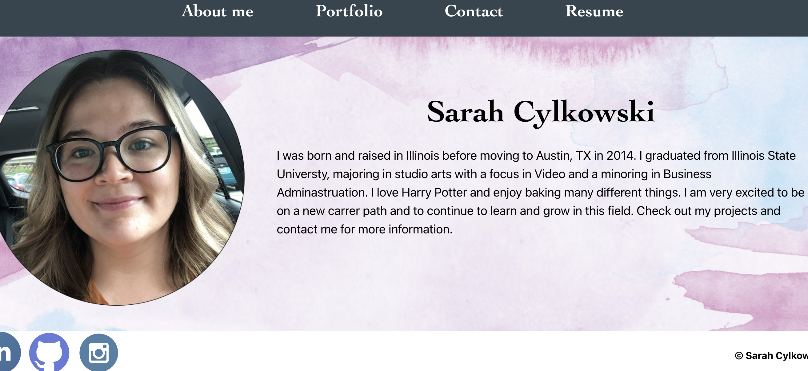

# React Portfolio

 ## Description
  This is a portfolio made with React.  It's an updated version of a previous portfolio I made.

  ## Installation
  To install required dependecies, use: 
  `npm install` 

  ## Usage
  To run the app, go to your command line and enter: `npm start` to run the app in development mode.  Open [http://localhost:3000](http://localhost:3000) to view it in your browser.  
  You can checkout the site below:  

<a href="https://sacylkowski.github.io/react-portfolio/">Here is the live site.</a>

  
  

 ## Built With
 This application is built with:  
 * React
 * HTML/CSS

  ## Questions
  If you have any questions, please reach out on <a href="https://github.com/sacylkowski/">GitHub</a> or you can <a href="mailto:sacylkowski@gmail.com">E-mail me</a>.
